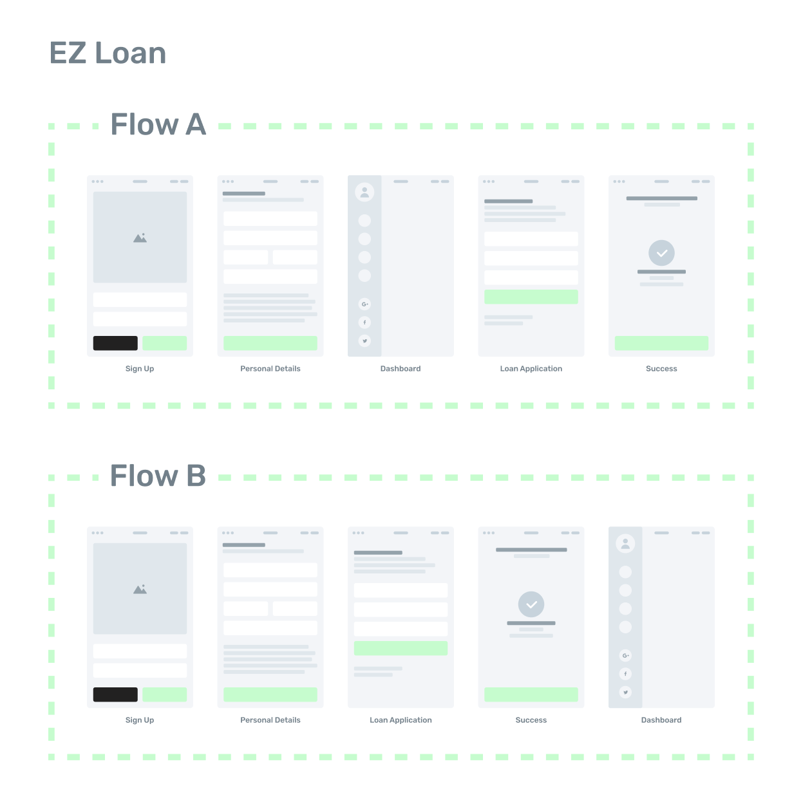

# EZ Loan

## Introduction

EZ Loan is a fictional company providing home loans to individuals through their easy to use web application.

In this scenario, you are recently hired as a Senior Backend Engineer to help architect and build the backend services for EZ Loan's onboarding web application.

Take some time to read through this document and prepare as necessary for a 1 hour session with the team at Super Obvious discussing this scenario and how you would best approach building the required backend services.

## Instructions

* Read the product brief below.
* Prepare as necessary for a follow up casual chat with the team at Super Obvious discussing how you would approach building the required backend services to support the application.
* Keep in mind that this fictional company has a fully staffed frontend team, and any concerns regarding the frontend (architecture, tech stack, etc) are not evaluated in our chat.
* We've kept this scenario open-ended by design, but some hints on what topics you could bring to the discussion include (but not limited to):
  * Infrastructure & architecture of the backend solution.
  * Tech stack choices & reasoning.
  * Data modeling to fulfil any business requirements.
* We're looking for high level solutions and concerns, rather than implementation of the specifics. You are encouraged to prepare and bring any supporting material to the discussion you deem appropriate (notes, sketches, code, brain dumps, etc), but note that only the interview itself will be evaluated, and no supporting material is required or will be kept by us for further evaluation.
* We value your time and greatly appreciate the effort spent applying for this role, please do not spend more than an hour in preparation for the chat!

## Product Brief

EZ Loan is starting the development phase of their initial app offering: An onboarding and dashboard experience for users to sign up and apply for a home loan.

The frontend team is hard at work building a design system and any UI concerns, whilst you are tasked with architecturing and building a backend solution for the web application to consume.

The product team has provided the engineering team with some wireframes of the application to be built:

The core features of the application should resolve the following user stories:

* As a User, I can sign up
* As a User, I can fill out my personal details, which are:
  * Full Name
  * Phone Number
  * Address
* As a User, I can apply for a loan, which requires:
  * An amount of money requested for loan
  * An uploaded document of my most recent bank statement
* As a User, I can view my personal details and loan application progress in a dashboard.
* As a User, I can login and be redirected to my dashboard.

A/B testing is a core focus for EZ Loan, and for the initial application two flows are required to be built:

### Flow A:

A User:
1. Signs up with a Sign Up form.
2. Enters personal details into a form.
3. Is presented with their dashboard, with a prompt to apply for a loan.
4. Upon clicking the prompt, enters information into a Loan Application form.
5. Is presented with a success page, and a prompt to return to the dashboard.

### Flow B:

A User:
1. Signs up with a Sign Up form.
2. Enters personal details into a form.
3. Enters information into a Loan Application form.
4. Is presented with a success page, and a prompt to continue to the dashboard.
5. Is presented with their dashboard.

The flow a user is entered in to is decided at random and is specific per user. In the future, new flows may be introduced and tested for conversion metrics.

## The Chat

We'll either bring you in or zoom for a chat with the team at Super Obvious about the above scenario. In the chat, you can expect us to ask questions about your approach to the scenario, a high-level walkthrough of a backend solution, as well as any concerns you may raise as a backend engineer. We're leaving this open ended by design, be creative!

